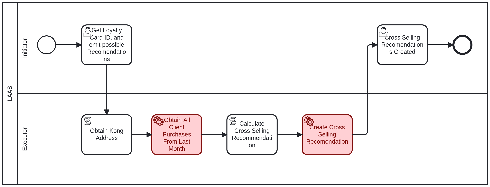

# Create Cross Selling Recommendation Business Process <!-- omit in toc -->

Table of Contents

- [LAAS - Initiator: Emit Cross Selling Recommendation](#laas---initiator-emit-cross-selling-recommendation)
  - [Rules](#rules)
- [LAAS - Initiator: Cross Selling Recomendations Created](#laas---initiator-cross-selling-recomendations-created)

## LAAS - Initiator: Emit Cross Selling Recommendation

The first task to create a cross selling recommendation, it is necessary to provide the following information:

- **LoyaltyCardID**: The ID of the loyalty card that will be used to create the cross selling recommendation, an integer value.

### Rules

The rules for the creation of the cross selling recommendation are:

- For customer A, identify the stores they visited most and least in the past month.
  - In case of ties (either for most visited or least visited stores), randomly select a maximum of 3 stores.
  - In the worst-case scenario, provide an array of 6 shop IDs.

## LAAS - Initiator: Cross Selling Recomendations Created

After the cross selling recommendation is created, the initiator must acknowledge that you have received confirmation of the creation.
The following information is provided:

- **crossSellingRecommendations**: The Ids of the shops that were used to create the cross selling recommendation, an array of integer values.
