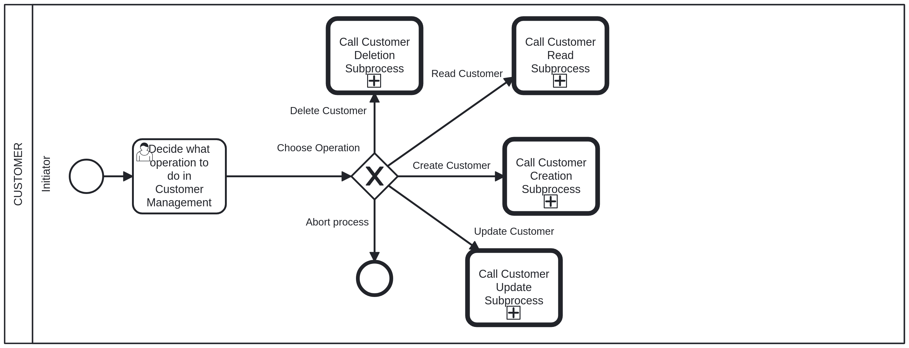

# Customer Management Business Process <!-- omit in toc -->

## Customer - Initiator: Choose Operation <!-- omit in toc -->

The first step in the customer management business process is to choose the operation you want to perform. The available operations are:

- **CREATE**: Create a new customer.
- **UPDATE**: Update an existing customer.
- **DELETE**: Delete an existing customer.
- **READ**: Retrieve a customer information.
- **ABORT**: Abort the current operation.

After choosing an operation, you will be prompted to provide the necessary information for that operation.

Documentation for each operation in the following files:

- [Create Customer](customer_creation.md)
- [Update Customer](customer_update.md)
- [Delete Customer](customer_deletion.md)
- [Read Customer](customer_read.md)
