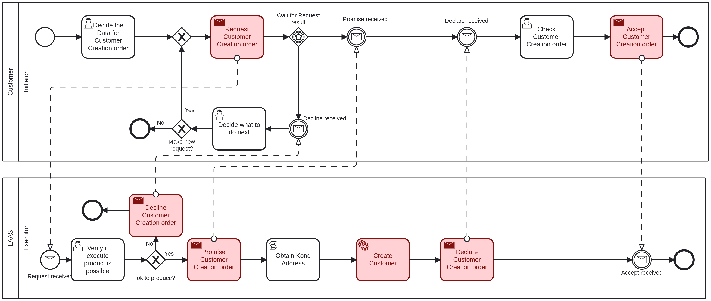

# Create Customer <!-- omit in toc -->

Table of Contents

- [Customer - Initiator: Decide the Data for Customer Creation order](#customer---initiator-decide-the-data-for-customer-creation-order)
- [LAAS - Executor: Verify if execute product is possible](#laas---executor-verify-if-execute-product-is-possible)
- [Customer - Initiator: Check Customer Creation order](#customer---initiator-check-customer-creation-order)
- [Customer - Initiator: Decide what to do next](#customer---initiator-decide-what-to-do-next)

## Customer - Initiator: Decide the Data for Customer Creation order

The first task to create a new customer, it is necessary to provide the following information:

- **FiscalNumber**: The fiscal number of the customer, an integer value.
- **LocationAddress**: The address of the customer, a string value.
- **LocationPostalCode**: The postal code of the customer's location, a string value.
- **Name**: The name of the customer, a string value.

## LAAS - Executor: Verify if execute product is possible

The executor will verify if the provided data is valid and if the customer can be created.

If the executer considers the product creation possible, it will proceed to create the customer and will return to the initiator in the ["Check Customer Creation order"](#customer---initiator-check-customer-creation-order) task.

If not, it goes to the ["Decide what to do next"](#customer---initiator-decide-what-to-do-next) task.

## Customer - Initiator: Check Customer Creation order

After the customer is created, the initiator must acknowledge that you have received confirmation of the creation.

The following information is provided:

- **CustomerID**: The ID of the customer that was created, an integer value.

## Customer - Initiator: Decide what to do next

If the executer said that the customer creation is not possible, the initiator can choose to make or not a new request with the same data.

If it chooses to make a new request, it will return to the ["Verify if execute product is possible"](#laas---executor-verify-if-execute-product-is-possible) task.

If not, the process will end.
