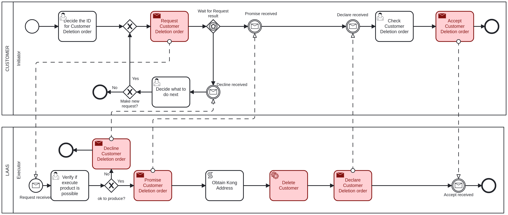

# Customer Deletion <!-- omit in toc -->

Table of Contents

- [Customer - Initiator: Decide the ID for Customer Deletion order](#customer---initiator-decide-the-id-for-customer-deletion-order)
- [LAAS - Executor: Verify if execute product is possible](#laas---executor-verify-if-execute-product-is-possible)
- [Customer - Initiator: Check Customer Deletion order](#customer---initiator-check-customer-deletion-order)
- [Customer - Initiator: Decide what to do next](#customer---initiator-decide-what-to-do-next)

## Customer - Initiator: Decide the ID for Customer Deletion order

The first task to delete a customer, it is necessary to provide the following information:

- **CustomerID**: The ID of the customer to be deleted, an integer value.

## LAAS - Executor: Verify if execute product is possible

The executor will verify if the provided data is valid and if the customer can be deleted.

If the executer considers the product deletion possible, it will proceed to delete the customer and will return to the initiator in the ["Check Customer Deletion order"](#customer---initiator-check-customer-deletion-order) task.

If not, it goes to the ["Decide what to do next"](#customer---initiator-decide-what-to-do-next) task.

## Customer - Initiator: Check Customer Deletion order

After the customer is deleted, the initiator must acknowledge that you have received confirmation of the deletion.

## Customer - Initiator: Decide what to do next

If the executer said that the customer deletion is not possible, the initiator can choose to make or not a new request with the same data.

If it chooses to make a new request, it will return to the ["Verify if execute product is possible"](#laas---executor-verify-if-execute-product-is-possible) task.

If not, the process will end.
