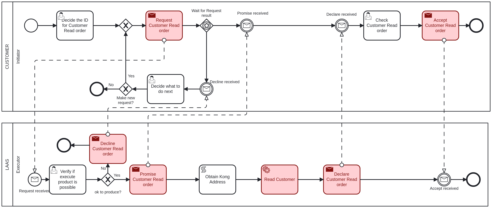

# Read Customer <!-- omit in toc -->

Table of Contents

- [Customer - Initiator: Decide the ID for Customer Read order](#customer---initiator-decide-the-id-for-customer-read-order)
- [LAAS - Executor: Verify if execute product is possible](#laas---executor-verify-if-execute-product-is-possible)
- [Customer - Initiator: Check Customer Read order](#customer---initiator-check-customer-read-order)
- [Customer - Initiator: Decide what to do next](#customer---initiator-decide-what-to-do-next)

## Customer - Initiator: Decide the ID for Customer Read order

The first task to read a customer, it is necessary to provide the following information:

- **CustomerID**: The ID of the customer to be read, an integer value.

## LAAS - Executor: Verify if execute product is possible

The executor will verify if the provided data is valid and if the customer can be read.

If the executer considers the product read possible, it will proceed to read the customer and will return to the initiator in the ["Check Customer Read order"](#customer---initiator-check-customer-read-order) task.

If not, it goes to the ["Decide what to do next"](#customer---initiator-decide-what-to-do-next) task.

## Customer - Initiator: Check Customer Read order

After the customer is read, the initiator must acknowledge that you have received confirmation of the read and, for that, the following information is provided:

- **CustomerID**: The ID of the customer that was read, an integer value.
- **FiscalNumber**: The fiscal number of the customer, an integer value.
- **LocationAddress**: The address of the customer, a string value.
- **LocationPostalCode**: The postal code of the customer's location, a string value.
- **Name**: The name of the customer, a string value.

## Customer - Initiator: Decide what to do next

If the executer said that the customer read is not possible, the initiator can choose to make or not a new request with the same data.

If it chooses to make a new request, it will return to the ["Verify if execute product is possible"](#laas---executor-verify-if-execute-product-is-possible) task.

If not, the process will end.
