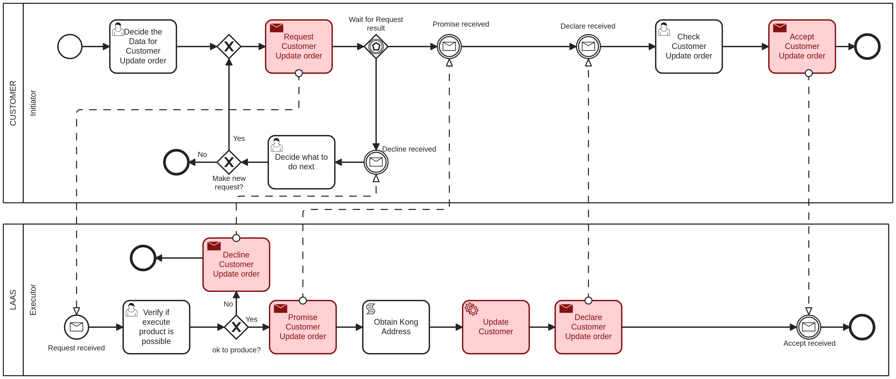

# Update Customer <!-- omit in toc -->

Table of Contents

- [Customer - Initiator: Decide the Data for Customer Update order](#customer---initiator-decide-the-data-for-customer-update-order)
- [LAAS - Executor: Verify if execute product is possible](#laas---executor-verify-if-execute-product-is-possible)
- [Customer - Initiator: Check Customer Update order](#customer---initiator-check-customer-update-order)
- [Customer - Initiator: Decide what to do next](#customer---initiator-decide-what-to-do-next)

## Customer - Initiator: Decide the Data for Customer Update order

The first task to update a customer, it is necessary to provide the following information:

- **CustomerID**: The ID of the customer to be updated, an integer value.
- **FiscalNumber**: The fiscal number of the customer, an integer value.
- **LocationAddress**: The address of the customer, a string value.
- **LocationPostalCode**: The postal code of the customer's location, a string value.
- **Name**: The name of the customer, a string value.

## LAAS - Executor: Verify if execute product is possible

The executor will verify if the provided data is valid and if the customer can be updated.

If the executer considers the product update possible, it will proceed to update the customer and will return to the initiator in the ["Check Customer Update order"](#customer---initiator-check-customer-update-order) task.

If not, it goes to the ["Decide what to do next"](#customer---initiator-decide-what-to-do-next) task.

## Customer - Initiator: Check Customer Update order

After the customer is updated, the initiator must acknowledge that you have received confirmation of the update.

## Customer - Initiator: Decide what to do next

If the executer said that the customer update is not possible, the initiator can choose to make or not a new request with the same data.

If it chooses to make a new request, it will return to the ["Verify if execute product is possible"](#laas---executor-verify-if-execute-product-is-possible) task.

If not, the process will end.
