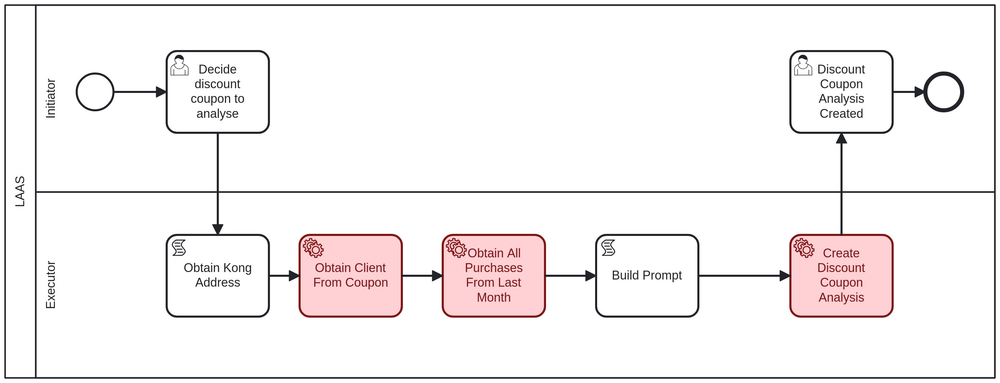

# Discount Coupon Analysis Business Process <!-- omit in toc -->



<details>
<summary>Table of Contents</summary>

- [LAAS - Initiator: Decide Discount Coupon to Analyze](#laas---initiator-decide-discount-coupon-to-analyze)
  - [Prompt:](#prompt)
- [LAAS - Initiator: Discount Coupon Analysis Created](#laas---initiator-discount-coupon-analysis-created)

</details>

## LAAS - Initiator: Decide Discount Coupon to Analyze

The first task to decide which discount coupon will be analyzed, it is necessary to provide the following information:

- **idDiscountCoupon**: The ID of the discount coupon to be analyzed, an integer value.

### Prompt:

The prompt sent to ollama will be something like this:

```
Please do a quantitative analysis of the purchases that used the discount coupon with id = __DISCOUNT_COUPON_ID__. A discount coupon can be applied in all products in a shops. This is a business assessment whether the customers valued the produced discount coupons by using them. These were the purchases of this client while the coupon was valid: __PURCHASES_DATA__. What is your assessment? Please keep your answer under 3500 characters."
```

The `__DISCOUNT_COUPON_ID__` will be replaced by the actual ID of the discount coupon being analyzed.

The `__PURCHASES_DATA__` will be a string containing the data of the purchases made by the customer while the coupon was valid, formatted as follows:

```json
[
  {
    "id": <integer>,
    "timestamp": "YYYY-MM-DDTHH:MM:SS",
    "price": <integer>,
    "product": "<string>",
    "supplier": "<string>",
    "shop_id": <integer>,
    "loyaltyCard_id": <integer>,
    "discountCoupon_id": <integer> or null
  },
  ...
]
```

There is a need for the answer to be under 3500 characters to ensure that the response can be stored in a camunda moduler variable.

## LAAS - Initiator: Discount Coupon Analysis Created

After the discount coupon analysis is created, the initiator must acknowledge that you have received confirmation of the creation.

The ollama response to the prompt will be shown.
