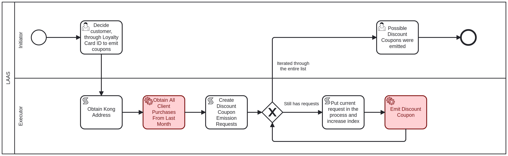

# Discount Coupon Emission Business Process <!-- omit in toc -->

Table of Contents

- [LAAS - Initiator: Decide Customer to Receive Discount Coupon](#laas---initiator-decide-customer-to-receive-discount-coupon)
  - [Rules](#rules)
- [LAAS - Initiator: Possible Discount Coupons were emitted](#laas---initiator-possible-discount-coupons-were-emitted)

## LAAS - Initiator: Decide Customer to Receive Discount Coupon

The first task to decide which customer will receive a discount coupon, it is necessary to provide the following information:

- **LoyaltyCardId**: The ID of the loyalty card associated with the customer, an integer value.

### Rules

The rules for deciding the discount coupons are:

- The customer gets a discount for store X if they visited store X more than 3 times in the last month.
- The discount value is inversely proportional to the number of visits to store X in the last month:
  - 15% for between 3 and 5 visits.
  - 10% for between 5 and 10 visits.
  - 5% for more than 10 visits.

## LAAS - Initiator: Possible Discount Coupons were emitted

After the discount coupon is emitted, the initiator must acknowledge that you have received confirmation of the emission.

The following information is provided:

- **discountCoupons**: The data of the discount coupons that were emitted, an array of objects with the following properties:
  - **idLoyaltyCard**: The ID of the loyalty card associated with the discount coupon, an integer value.
  - **idsShops**: The IDs of the shops where the discount coupon can be used, an array of integer values.
  - **discount**: The discount percentage offered by the coupon, an integer value.
  - **expirationDate**: The expiration date of the discount coupon, a string in ISO 8601 format (e.g., "2025-12-31T23:59:59").
