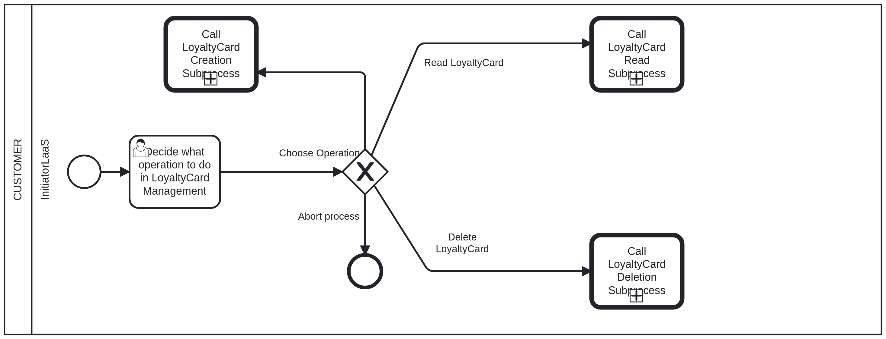

# LoyaltyCard Management Business Process <!-- omit in toc -->

## LoyaltyCard - Initiator: Choose Operation <!-- omit in toc -->

The first step in the loyalty card management business process is to choose the operation you want to perform. The available operations are:

- **CREATE**: Create a new loyalty card.
- **DELETE**: Delete an existing loyalty card.
- **READ**: Retrieve a loyalty card information.
- **ABORT**: Abort the current operation.

After choosing an operation, you will be prompted to provide the necessary information for that operation.

Documentation for each operation in the following files:

- [Create LoyaltyCard](loyaltyCard_creation.md)
- [Delete LoyaltyCard](loyaltyCard_deletion.md)
- [Read LoyaltyCard](loyaltyCard_read.md)
