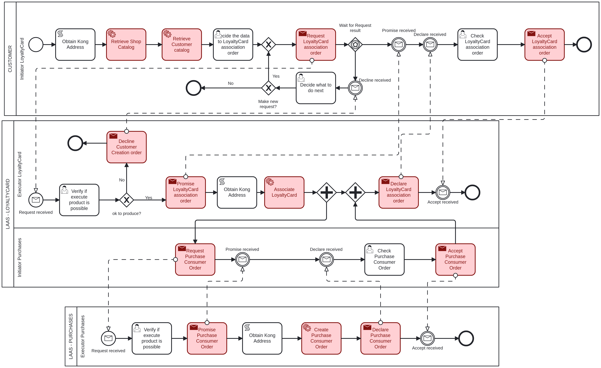

# Create LoyaltyCard <!-- omit in toc -->

Table of Contents

- [Customer - Initiator LoyaltyCard: Decide the Data for LoyaltyCard Creation order](#customer---initiator-loyaltycard-decide-the-data-for-loyaltycard-creation-order)
- [LAAS - LOYALTYCARD - Executor LoyaltyCard: Verify if execute product is possible](#laas---loyaltycard---executor-loyaltycard-verify-if-execute-product-is-possible)
- [Customer - Initiator LoyaltyCard: Decide what to do next](#customer---initiator-loyaltycard-decide-what-to-do-next)
- [LAAS - PURCHASE - Executor Purchase: Verify if execute product is possible](#laas---purchase---executor-purchase-verify-if-execute-product-is-possible)
- [LAAS - LOYALTYCARD - Initiator Purchase: Check Purchase Consumer order](#laas---loyaltycard---initiator-purchase-check-purchase-consumer-order)
- [Customer - Initiator LoyaltyCard: Check LoyaltyCard Creation order](#customer---initiator-loyaltycard-check-loyaltycard-creation-order)

## Customer - Initiator LoyaltyCard: Decide the Data for LoyaltyCard Creation order

The first task to create a new loyalty card, it is necessary to provide the following information:

- **CustomerID**: The ID of the customer that will own the loyalty card, an integer value.
- **ShopID**: The ID of the shop where the loyalty card will be created, an integer value.

## LAAS - LOYALTYCARD - Executor LoyaltyCard: Verify if execute product is possible

The executor will verify if the provided data is valid and if the loyalty card can be created.

If the executer considers the product creation possible, it will proceed to create the loyalty card and the next task will be the ["Verify if execute product is possible"](#laas---purchase---executor-purchase-verify-if-execute-product-is-possible) task.

If not, it goes to the ["Decide what to do next"](#customer---initiator-loyaltycard-decide-what-to-do-next) task.

## Customer - Initiator LoyaltyCard: Decide what to do next

If the executer said that the loyalty card creation is not possible, the initiator can choose to make or not a new request with the same data.

If it chooses to make a new request, it will return to the ["Verify if execute product is possible"](#laas---loyaltycard---executor-loyaltycard-verify-if-execute-product-is-possible) task.

If not, the process will end.

## LAAS - PURCHASE - Executor Purchase: Verify if execute product is possible

The executor will verify if the provided data is valid and it will proceed to create the purchase topic and the next task will be the ["Check Purchase Consumer order"](#laas---loyaltycard---initiator-purchase-check-purchase-consumer-order) task.

## LAAS - LOYALTYCARD - Initiator Purchase: Check Purchase Consumer order

After the purchase topic is created, the initiator must acknowledge that you have received confirmation of the creation.

The following information is provided:

- **TopicName**: The name of the topic that was created, a string value.

After this task, the process will continue to the ["Check LoyaltyCard Creation order"](#customer---initiator-loyaltycard-check-loyaltycard-creation-order) task.

## Customer - Initiator LoyaltyCard: Check LoyaltyCard Creation order

After the loyalty card is created, the initiator must acknowledge that you have received confirmation of the creation.

The following information is provided:

- **LoyaltyCardID**: The ID of the loyalty card that was created, an integer value.

After this task, the process will end.
