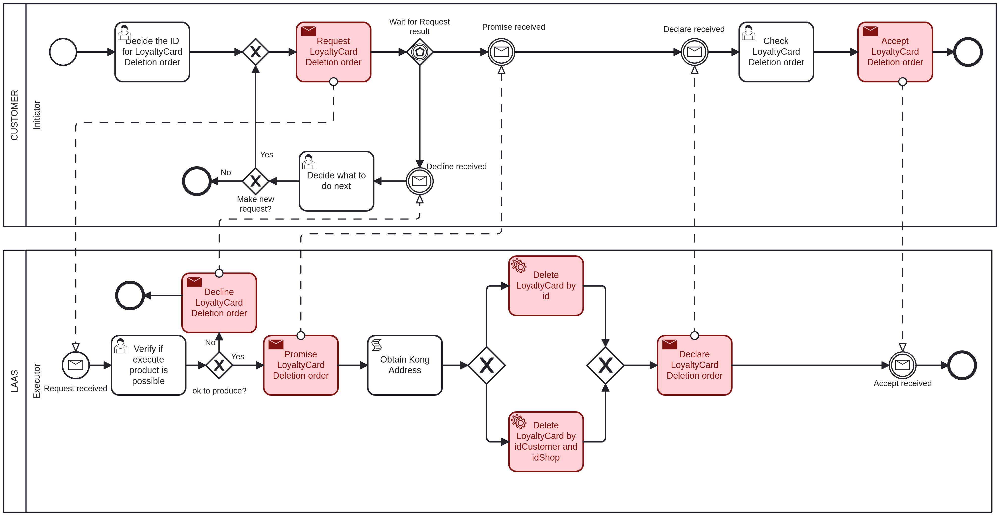

# Delete LoyaltyCard <!-- omit in toc -->

Table of Contents

- [Customer - Initiator: Decide the Data for LoyaltyCard Deletion order](#customer---initiator-decide-the-data-for-loyaltycard-deletion-order)
- [LAAS - Executor: Verify if execute product is possible](#laas---executor-verify-if-execute-product-is-possible)
- [Customer - Initiator: Check LoyaltyCard Deletion order](#customer---initiator-check-loyaltycard-deletion-order)
- [Customer - Initiator: Decide what to do next](#customer---initiator-decide-what-to-do-next)

## Customer - Initiator: Decide the Data for LoyaltyCard Deletion order

The first task to delete a loyalty card, it is necessary to provide the following information:

- **LoyaltyCardID**: The ID of the loyalty card that will be deleted, an integer value.
- **CustomerID**: The ID of the customer that owns the loyalty card to be deleted, an integer value.
- **ShopID**: The ID of the shop where the loyalty card to be deleted was created, an integer value.

The **LoyaltyCardID** can be null if the **CustomerID** and **ShopID** are provided and vice versa. If both are provided, the **LoyaltyCardID** will be used to delete the loyalty card of all shops where the customer has a loyalty card.

## LAAS - Executor: Verify if execute product is possible

The executor will verify if the provided data is valid and if the loyalty card can be deleted.

If the executer considers the product deletion possible, it will proceed to delete the customer and will return to the initiator in the ["Check Customer Deletion order"](#customer---initiator-check-loyaltycard-deletion-order) task.

If not, it goes to the ["Decide what to do next"](#customer---initiator-decide-what-to-do-next) task.

## Customer - Initiator: Check LoyaltyCard Deletion order

After the loyalty card is deleted, the initiator must acknowledge that you have received confirmation of the deletion.

## Customer - Initiator: Decide what to do next

If the executer said that the loyalty card deletion is not possible, the initiator can choose to make or not a new request with the same data.

If it chooses to make a new request, it will return to the ["Verify if execute product is possible"](#laas---executor-verify-if-execute-product-is-possible) task.

If not, the process will end.
