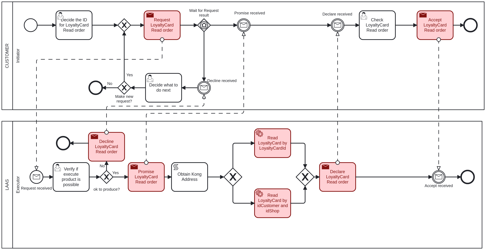

# Read LoyaltyCard <!-- omit in toc -->

Table of Contents

- [Customer - Initiator: Decide the Data for LoyaltyCard Read order](#customer---initiator-decide-the-data-for-loyaltycard-read-order)
- [LAAS - Executor: Verify if execute product is possible](#laas---executor-verify-if-execute-product-is-possible)
- [Customer - Initiator: Check LoyaltyCard Read order](#customer---initiator-check-loyaltycard-read-order)
- [Customer - Initiator: Decide what to do next](#customer---initiator-decide-what-to-do-next)

## Customer - Initiator: Decide the Data for LoyaltyCard Read order

The first task to read a loyalty card, it is necessary to provide the following information:

- **LoyaltyCardID**: The ID of the loyalty card that will be read, an integer value.
- **CustomerID**: The ID of the customer that owns the loyalty card, an integer value.
- **ShopID**: The ID of the shop where the loyalty card was created, an integer value.

The **LoyaltyCardID** can be null if the **CustomerID** and **ShopID** are provided and vice versa. If both are provided, the **LoyaltyCardID** will be used to read the loyalty card.

## LAAS - Executor: Verify if execute product is possible

The executor will verify if the provided data is valid and if the loyalty card can be read.

If the executer considers the product read possible, it will proceed to read the loyalty card and will return to the initiator in the ["Check LoyaltyCard Read order"](#customer---initiator-check-loyaltycard-read-order) task.

If not, it goes to the ["Decide what to do next"](#customer---initiator-decide-what-to-do-next) task.

## Customer - Initiator: Check LoyaltyCard Read order

After the loyalty card is read, the initiator must acknowledge that you have received confirmation of the read and, for that, the following information is provided:

- **LoyaltyCardID**: The ID of the loyalty card that was read, an integer value.
- **CustomerID**: The ID of the customer that owns the loyalty card, an integer value.
- **ShopID**: The ID or IDS of the shop or shops where the loyalty card was created, an integer value or a list of integer values.

## Customer - Initiator: Decide what to do next

If the executer said that the loyalty card read is not possible, the initiator can choose to make or not a new request with the same data.

If it chooses to make a new request, it will return to the ["Verify if execute product is possible"](#laas---executor-verify-if-execute-product-is-possible) task.

If not, the process will end.
