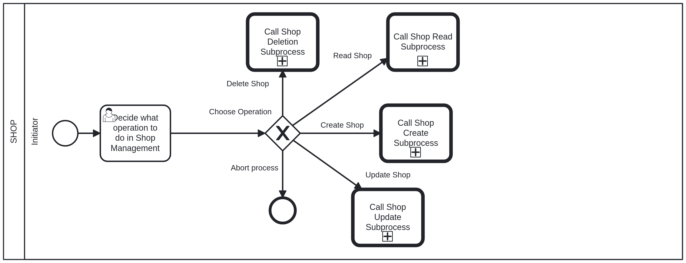

# Shop Management Business Process <!-- omit in toc -->

## Shop - Initiator: Choose Operation <!-- omit in toc -->

The first step in the shop management business process is to choose the operation you want to perform. The available operations are:

- **CREATE**: Create a new shop.
- **UPDATE**: Update an existing shop.
- **DELETE**: Delete an existing shop.
- **READ**: Retrieve a shop information.
- **ABORT**: Abort the current operation.

After choosing an operation, you will be prompted to provide the necessary information for that operation.

Documentation for each operation in the following files:

- [Create Shop](shop_creation.md)
- [Update Shop](shop_update.md)
- [Delete Shop](shop_deletion.md)
- [Read Shop](shop_read.md)
