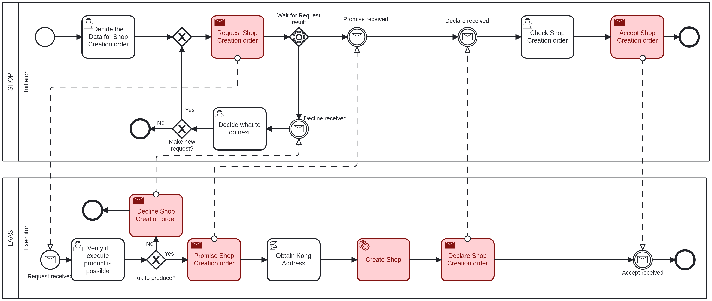

# Create Shop <!-- omit in toc -->

Table of Contents

- [Shop - Initiator: Decide the Data for Shop Creation order](#shop---initiator-decide-the-data-for-shop-creation-order)
- [LAAS - Executor: Verify if execute product is possible](#laas---executor-verify-if-execute-product-is-possible)
- [Shop - Initiator: Check Shop Creation order](#shop---initiator-check-shop-creation-order)
- [Shop - Initiator: Decide what to do next](#shop---initiator-decide-what-to-do-next)

## Shop - Initiator: Decide the Data for Shop Creation order

The first task to create a new shop, it is necessary to provide the following information:

- **LocationAddress**: The address of the shop, a string value.
- **LocationPostalCode**: The postal code of the shop's location, a string value.
- **Name**: The name of the shop, a string value.

## LAAS - Executor: Verify if execute product is possible

The executor will verify if the provided data is valid and if the shop can be created.

If the executer considers the product creation possible, it will proceed to create the shop and will return to the initiator in the ["Check Shop Creation order"](#shop---initiator-check-shop-creation-order) task.

If not, it goes to the ["Decide what to do next"](#shop---initiator-decide-what-to-do-next) task.

## Shop - Initiator: Check Shop Creation order

After the shop is created, the initiator must acknowledge that you have received confirmation of the creation.

The following information is provided:

- **ShopID**: The ID of the shop that was created, an integer value.

## Shop - Initiator: Decide what to do next

If the executer said that the shop creation is not possible, the initiator can choose to make or not a new request with the same data.

If it chooses to make a new request, it will return to the ["Verify if execute product is possible"](#laas---executor-verify-if-execute-product-is-possible) task.

If not, the process will end.
