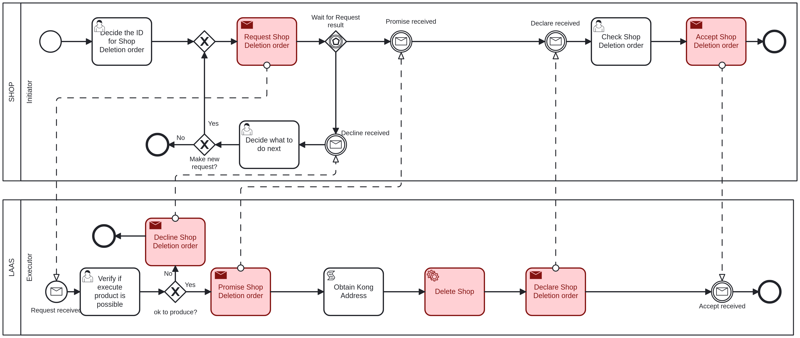

# Delete Shop <!-- omit in toc -->

Table of Contents

- [Shop - Initiator: Decide the ID for Shop Deletion order](#shop---initiator-decide-the-id-for-shop-deletion-order)
- [LAAS - Executor: Verify if execute product is possible](#laas---executor-verify-if-execute-product-is-possible)
- [Shop - Initiator: Check Shop Deletion order](#shop---initiator-check-shop-deletion-order)
- [Shop - Initiator: Decide what to do next](#shop---initiator-decide-what-to-do-next)

## Shop - Initiator: Decide the ID for Shop Deletion order

The first task to delete a shop, it is necessary to provide the following information:

- **ShopID**: The ID of the shop to be deleted, an integer value.

## LAAS - Executor: Verify if execute product is possible

The executor will verify if the provided data is valid and if the shop can be deleted.

If the executer considers the product deletion possible, it will proceed to delete the shop and will return to the initiator in the ["Check Shop Deletion order"](#shop---initiator-check-shop-deletion-order) task.

If not, it goes to the ["Decide what to do next"](#shop---initiator-decide-what-to-do-next) task.

## Shop - Initiator: Check Shop Deletion order

After the shop is deleted, the initiator must acknowledge that you have received confirmation of the deletion.

## Shop - Initiator: Decide what to do next

If the executer said that the shop deletion is not possible, the initiator can choose to make or not a new request with the same data.

If it chooses to make a new request, it will return to the ["Verify if execute product is possible"](#laas---executor-verify-if-execute-product-is-possible) task.

If not, the process will end.
