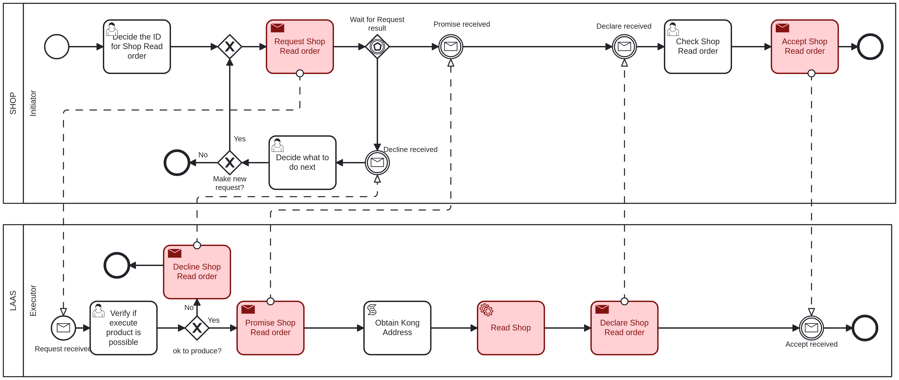

# Read Shop <!-- omit in toc -->

Table of Contents

- [Shop - Initiator: Decide the ID for Shop Read order](#shop---initiator-decide-the-id-for-shop-read-order)
- [LAAS - Executor: Verify if execute product is possible](#laas---executor-verify-if-execute-product-is-possible)
- [Shop - Initiator: Check Shop Read order](#shop---initiator-check-shop-read-order)
- [Shop - Initiator: Decide what to do next](#shop---initiator-decide-what-to-do-next)

## Shop - Initiator: Decide the ID for Shop Read order

The first task to read a shop, it is necessary to provide the following information:

- **ShopID**: The ID of the shop to be read, an integer value.

## LAAS - Executor: Verify if execute product is possible

The executor will verify if the provided data is valid and if the shop can be read.

If the executer considers the product read possible, it will proceed to read the shop and will return to the initiator in the ["Check Shop Read order"](#shop---initiator-check-shop-read-order) task.

If not, it goes to the ["Decide what to do next"](#shop---initiator-decide-what-to-do-next) task.

## Shop - Initiator: Check Shop Read order

After the shop is read, the initiator must acknowledge that you have received confirmation of the read and, for that, the following information is provided:

- **ShopID**: The ID of the shop that was read, an integer value.
- **LocationAddress**: The address of the shop, a string value.
- **LocationPostalCode**: The postal code of the shop's location, a string value.
- **Name**: The name of the shop, a string value.

## Shop - Initiator: Decide what to do next

If the executer said that the shop read is not possible, the initiator can choose to make or not a new request with the same data.

If it chooses to make a new request, it will return to the ["Verify if execute product is possible"](#laas---executor-verify-if-execute-product-is-possible) task.

If not, the process will end.
